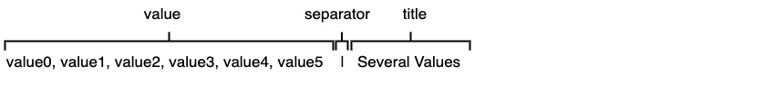
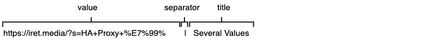

# Enclst
## What is this?
The Enclst is a notation rule for **humans** to write a list structure **concisely**.

## What is this for?
This is for what humans write a **list of data** with **attributes** and **title string** that a computer handles the data. Typically the data is something ID like a **URL of a website** or a **content ID of YouTube**. 

## Why not JSON?
JSON is a rich notation enough to represent general objects including lists. There is no difficulty for a computer program to handle a JSON. However it comes to humans, it isn't easy to write a no-error JSON string. When you try to write JSON by hand, you may notice the following pitfalls:

- Prohibition of dangling commas
- String escaping

Even experienced software engineers (like me :-) write a JSON by hand carefully, it's impossible to continue writing without any errors. Furthermore, asking **non-engineering end users** to input **error-free JSON** is unreasonable.

This is exactly my motivation for creating enclst. JSON is impossible for a non-engineer end user. A more succinct alternative must be necessary.

# Enclst Notation
## The Structure of the Enclst.
An **Enclst** is a multi-line string separated by line breaks. The **first line** is interpreted as the **title string** for the entire enclst, followed by the **ItemList** separated by **a blank line** illustrated as follow:


## ItemList
The **ItemList** is a multi-line string that is the remainder of Enclst followed by The **Title** and a blank separator line, and each low is one **Item**. 

## Item
An Item is consist of **Value** and **Title** separated by a vertical line "**|**".


## Title
Note: In a title string, any **escaping is not needed**. Even commas "**,**" and vertical lines "**|**", you can use them **without escaping**.
```
https://www.bhg.com/gardening/plant-dictionary/ | Titles like this, |also| OK!
```

## Value

A value can have several values separated by comma "**,**".




### Positional
These values can be referred to as **positional values** of a value of an item with a library like as:

```
item.value.positional[0] // equal "value0"
```

### Named
A value containing an equal sign can refer to the right side using the left side as a name with a library as follows:


```
item.value.positional // equal ["value0", "val=kerokero", "attr=gerogero", "value"]
item.value.named["val"]  // equal "kerokero"
item.value.named["attr"] // equal "gerogero"
```

Note that a URL that includes parameters is interpreted as a named parameter, but it is not your expected. So refer to the named parameter only if you are intended, otherwise, refer to a positional parameter.



```
item.value.positional[0] // equal "https://iret.media/?s=HA+Proxy+%E7%99%" and it must be your intention.
item.value.named["https://iret.media/?s"] // equal "HA+Proxy+%E7%99%" but it must be not your intention.
```

## For more details
More detail of Enclst Notation is available [here](documents/Enclst.md).

# API
- for JavaScript: [Enclist-core-js](https://github.com/UedaTakeyuki/enclst-core-js/tree/main)

# Application examples

## For Website URL
[EncycloList](https://encyclolist.uedasoft.com/): A browser to display the list of Items that consists of a **website URL** and a **its title**, and opens the URL in which selected Item.
- [British Newspapers](https://encyclolist.uedasoft.com/list/https:%2F%2Fraw.githubusercontent.com%2FUedaTakeyuki%2FEncLst%2Fmain%2Fexamples%2FEncycloList%2Flang%2Fen%2Fnewspaper%2Fnewspaper.enclst): displaying enclst is [here](https://github.com/UedaTakeyuki/EncLst/blob/main/examples/EncycloList/lang/en/newspaper/newspaper.enclst)
- [Journal Française](https://encyclolist.uedasoft.com/list/https:%2F%2Fraw.githubusercontent.com%2FUedaTakeyuki%2FEncLst%2Fmain%2Fexamples%2FEncycloList%2Flang%2Ffr%2Fjournal%2Fjournal.enclst): displaying enclst is [here](https://github.com/UedaTakeyuki/EncLst/blob/main/examples/EncycloList/lang/fr/journal/journal.enclst)
- [more examples…](https://github.com/UedaTakeyuki/EncLst/wiki/EncycloList-example-pages)
 
## For Youtube Contents
[HS](https://hs.uedasoft.com/channel2/home): A browser to display the list of Items that consists of a **youtube contents ID** and **its title**, and play the contents in which selected Item.
- [Nouvelle Francais](https://hs.uedasoft.com/channel2/?url=https%3A%2F%2Fraw.githubusercontent.com%2FUedaTakeyuki%2FHS2playlist%2Fmain%2Fnews%2Ffrancais.enclst): displaying enclst is [here](https://github.com/UedaTakeyuki/HS2playlist/blob/main/news/francais.enclst).
- [TV Programs](https://hs.uedasoft.com/channel2/?url=https%3A%2F%2Fraw.githubusercontent.com%2FUedaTakeyuki%2FHS2playlist%2Fmain%2Ftvprogram%2Fmenu.enclst): displaying enclst is [here](https://github.com/UedaTakeyuki/HS2playlist/blob/main/tvprogram/menu.enclst).
- [more examples…](https://github.com/UedaTakeyuki/EncLst/wiki/EncycloList-example-pages)

