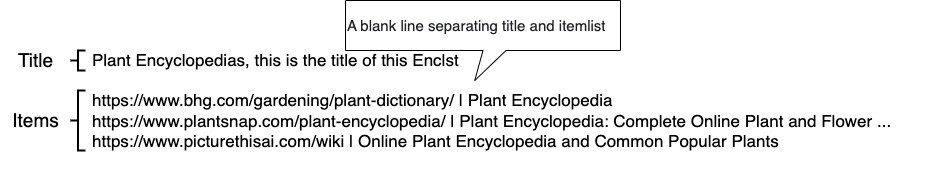

# Enclst
## What is it?
The enclst is a notation rule for **humans** to write a list structure **concisely**.

## What is it for?
This is for what humans write a **list of data** with **attributes** and **title string** that a computer handles the data. Typically the data is something ID like a **URL of a website** or a **content ID of YouTube**. 

## Why not JSON?
JSON is a rich notation enough to represent general objects including lists. There is no difficulty for a computer program to handle a JSON. However it comes to humans, it isn't easy to write a no-error JSON string. When you try to write JSON by hand, you may notice the following pitfalls:

- Prohibition of dangling commas
- String escaping

Even experienced software engineers (like me :-) write a JSON by hand carefully, it's impossible to continue writing without any errors. Furthermore, asking **non-engineering end users** to input **error-free JSON** is unreasonable.

This is exactly my motivation for creating enclst. JSON is impossible for a non-engineer end user. A more succinct alternative must be necessary.

# Enclst Notation
An **Enclst** is a multi-line string separated by line breaks. The **first line** is the **Title** of the Enclst, followed by the **ItemList** separated by **a blank line** illustrated as follow:



The **ItemList** is a multi-line string that is the remainder of Enclst followed by The **Title** and a blank separator line, and each low is one **Item**. An Item is consist of **Value** and **Title** separated by vertical line **|**.


A value can have several values separated by comma **,**.

Note,

The **Enclst Notation** consists of **Title** string and **ItemList** separated by a **blank line**, fx:

```
Plant Encyclopedias, this is the title of this Enclst

https://www.bhg.com/gardening/plant-dictionary/ | Plant Encyclopedia
https://www.plantsnap.com/plant-encyclopedia/ | Plant Encyclopedia: Complete Online Plant and Flower ...
https://www.picturethisai.com/wiki | Online Plant Encyclopedia and Common Popular Plants
```

The ``first line`` is the **Title** of this Enclist which is separated from the remaining **ItemList** by a **blank line** at ``second line``.

Each part is defined as follows:

- Title  
A **single line string** that is terminated by a new line code like ``the first line``.  


- Blank line  
A blank line like ``line 2`` which has only line feed. The Encyclolist application recognizes the lines after this blank line as **itemlist.**

- ItemList  
Multiple strings where one line represents one item.

Illustrated below:


## Title

The **Title** is a **single line string** terminated by a new line code.  

If multiple lines exist before the first blank line, only the first line will be recognized as the title. 

```
Plant Encyclopedias, this is the title of this Enclst
This line is not title, just be ignored
This lie is also not title

https://www.bhg.com/gardening/plant-dictionary/ | Plant Encyclopedia
https://www.plantsnap.com/plant-encyclopedia/ | Plant Encyclopedia: Complete Online Plant and Flower ...
https://www.picturethisai.com/wiki | Online Plant Encyclopedia and Common Popular Plants
```

Note that the current version of the Encyclolist application ignores the rest of the lines, but future versions may interpret those lines to have some special meaning. Anyway, currently only the ``first line`` is recognized as the **title**

## Item List
The item list is lines of items each line consists of the **URL**, a vertical bar **|** and **item title** as follows:

```
https://www.bhg.com/gardening/plant-dictionary/ | Plant Encyclopedia
```

The Encyclolist application use the above **URL** as a bookmark link and **item title** as a line title.

More precisely, the Encyclolist application recognizes the first vertical bar delimited forward as the **URL** and the rest as the **item title**. So even if the item title string itself contains **|** , they are treated as part of the title normally.

```
https://www.bhg.com/gardening/plant-dictionary/ | ItemTitle |no problem|
```

FYI **|** is not a character that can be used in URLs so there is no real case where it appears in URLs. But in case you put **|** inside your URL, The Encyclolist application miss-recognizes the first half of the string separated by **|** as the URL.

The Encyclolist application simply discards lines that cannot be recognized as item. More precisely if there is no **|**, this line just be ignored.

## Special case

### Blank first line
In case the **first line is blank**, the Encyclolist application recognizes that this enclst has **blank title** whcih consist of only brank character. If you want to omit the title, start with a blank line like this.

```

https://www.bhg.com/gardening/plant-dictionary/ | Plant Encyclopedia
https://www.plantsnap.com/plant-encyclopedia/ | Plant Encyclopedia: Complete Online Plant and Flower ...
https://www.picturethisai.com/wiki | Online Plant Encyclopedia and Common Popular Plants
```

### Last line blank
Blank lines at the end of sentences are ignored.
```
https://www.bhg.com/gardening/plant-dictionary/ | Plant Encyclopedia
https://www.plantsnap.com/plant-encyclopedia/ | Plant Encyclopedia: Complete Online Plant and Flower ...
https://www.picturethisai.com/wiki | Online Plant Encyclopedia and Common Popular Plants


```


### No blank line
In case there are **no blank lines**, the expected Encyclolist application behaviour is **undefined**. 

The application strives to guess if the first line is the title line or the first line of Item list. It's reasonable to hope that future versions of the application will be smart enough.　But the earlier version of the application might recognize that the first line is the **title** and this ecnlst has **blank ItemList** that has no item. It may not be probable the result you wanted, you forgot to start with a blank line to omit the title.

### Several blank lines
In case there are **several blank lines**, The Encyclolist application recognizes as **title** of the first line and as **ItemList** as remaining. Also, the Encyclolist application simply discards lines that cannot be recognized as items. As a result, these multi-blank line enclst is recognized as the same as normal single blank line enclst

```
Plant Encyclopedias

https://www.bhg.com/gardening/plant-dictionary/ | Plant Encyclopedia

https://www.plantsnap.com/plant-encyclopedia/ | Plant Encyclopedia:
```

# Application examples

- [EncycloList](https://encyclolist.uedasoft.com/): A Browser to show an enclist of **website URL** and **its title**.
  - [British Newspapers](https://encyclolist.uedasoft.com/list/https:%2F%2Fraw.githubusercontent.com%2FUedaTakeyuki%2FEncLst%2Fmain%2Fexamples%2FEncycloList%2Flang%2Fen%2Fnewspaper%2Fnewspaper.enclst): displaying enclst is [here](https://github.com/UedaTakeyuki/EncLst/blob/main/examples/EncycloList/lang/en/newspaper/newspaper.enclst)
  - [Journal Française](https://encyclolist.uedasoft.com/list/https:%2F%2Fraw.githubusercontent.com%2FUedaTakeyuki%2FEncLst%2Fmain%2Fexamples%2FEncycloList%2Flang%2Ffr%2Fjournal%2Fjournal.enclst): displaying enclst is [here](https://github.com/UedaTakeyuki/EncLst/blob/main/examples/EncycloList/lang/fr/journal/journal.enclst)
  - [more examples…](https://github.com/UedaTakeyuki/EncLst/wiki/EncycloList-example-pages)
- [HS](https://hs.uedasoft.com/channel2/home): A web application to watch a contents from enclst of **youtube contents**.
